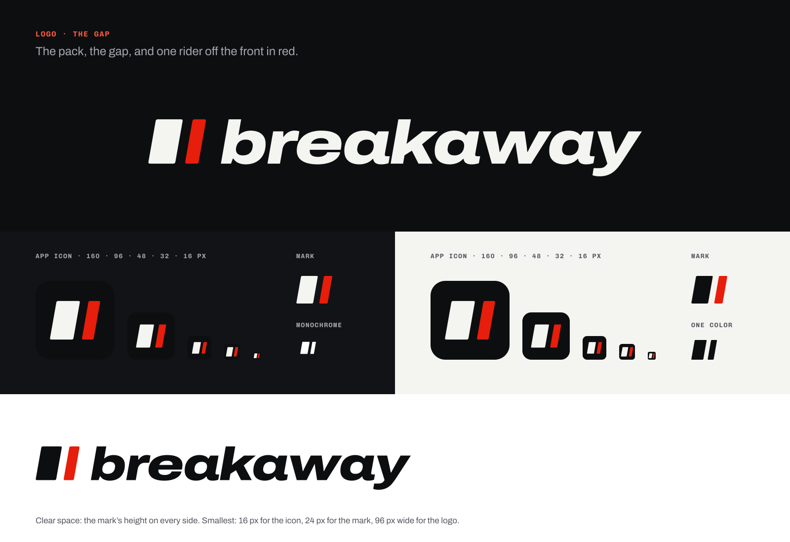
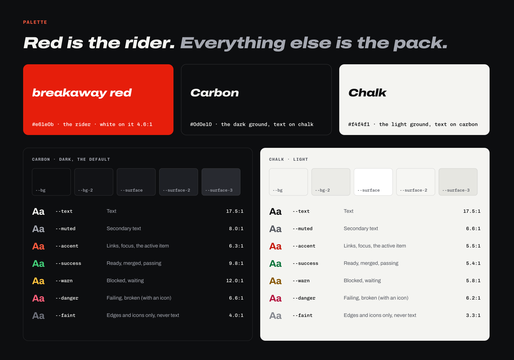
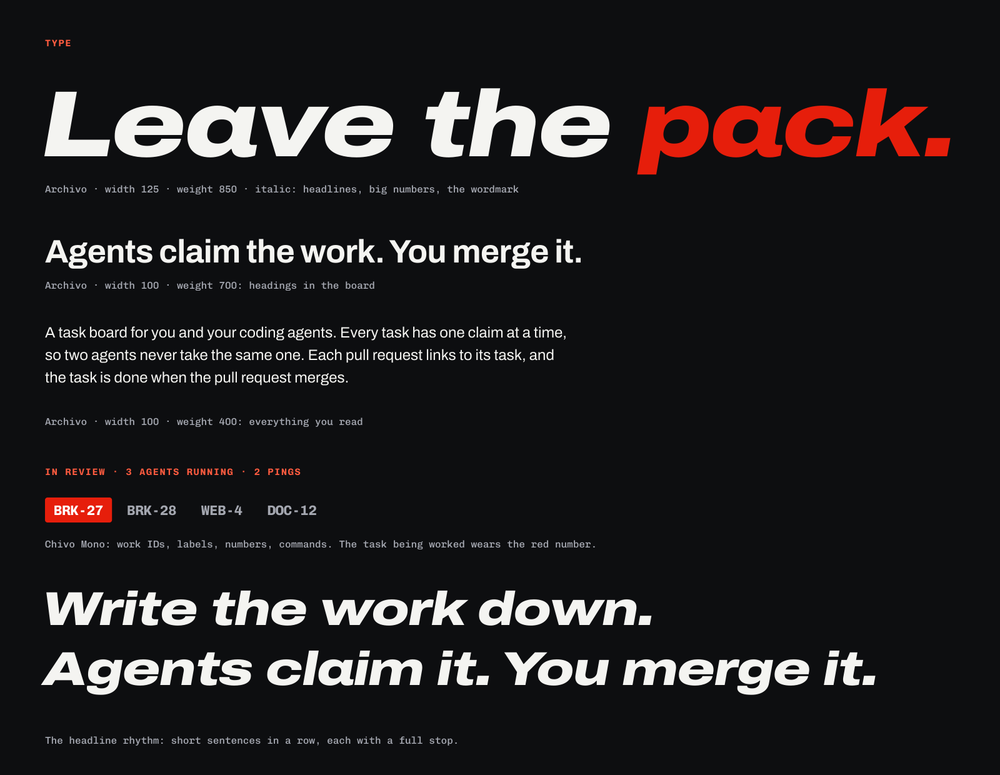

# breakaway brand guide

<!-- brand-lint-ignore-file name, never-word, exclamation, open-source: the guide quotes what the lint catches. -->

How breakaway looks and sounds everywhere: the board, its docs, the landing page, and launch posts. Follow it for every string and every pixel, whether you're a person or an agent.

A breakaway is the rider who leaves the pack and holds the lead alone. That's the feeling to get across: the frontier, moving fast, one person with one tool. So the brand is loud and fast, and it never claims more than is true.

**In one line:** breakaway is a task board for you and your coding agents: they claim the work, you merge it.
**Tagline:** Leave the pack.

## The name

- **Always lowercase: breakaway.** At the start of a sentence too, in headings, and in the logo. Never "Breakaway", "BreakAway", "BREAKAWAY", "Break Away", or "break-away". In code and on the command line it's `breakaway` as well.
- **One word, and a thing, not a person:** "breakaway marks the task done", not "breakaway thinks". The board doesn't say "we".
- **Keep it out of uppercase labels.** Kickers and labels are set in capitals, and "BREAKAWAY" isn't the name. Leave the name out of them.

## Voice

breakaway sounds like the rider who just went clear: sure of the move, short of breath, no time for filler. Loud and fast where most tools are calm, and still true.

| breakaway is | breakaway isn't |
| --- | --- |
| **Fast.** The point first, in as few words as it takes. Verb first, number first: "3 agents running." | Slow. Preambles, "please note", "in order to", "it looks like". |
| **Loud.** Short lines said with conviction and set big. One idea per line, then a full stop. | Shouting. Capitalised sentences, exclamation marks, emoji. Loud comes from size and certainty, not volume. |
| **True.** Only what the board does today, and numbers that happened. | Promises and benchmarks: "10x your output", "replace your team", speed nobody measured. |
| **Plain where it counts.** Buttons, statuses, errors, and docs use the literal word. | Clever at the cost of clear. A button says "Claim", not "Attack". |
| **On your side.** Talks to you, the person running the board, and gives agents credit for their work. | Smug, or taking shots at other tools or at people who work differently. |

### Writing it

- **Headlines** are 2 to 6 words with a full stop, never an exclamation mark: "Leave the pack." "Agents claim the work. You merge it." Rhythm comes from short sentences in a row: "Write the work down. Agents claim it. You merge it."
- **Sentence case** for everything: headings, buttons, menu items, dialog titles.
- **Buttons are verbs** that say what happens: "Claim", "Release", "Start the next few", "Merge". Never "OK", "Submit", or "Yes". A confirm dialog asks the question ("Release BRK-12?") and says what follows ("Anyone can claim it after.").
- **Errors** say what failed and what to do, in one line, without blame or codes: "Couldn't claim BRK-12: claude-a has it." Never "Oops", and never "Something went wrong" on its own.
- **Success is a word or two**, or nothing when the screen already shows it: "Claimed." "Merged."
- **Empty states may be loud**: "All clear. Nothing waits on you."
- **Numbers are digits**, and real or left out. Use tabular figures in tables and counters.
- **Address the person as "you".** Name agents by their name (`claude-brd-27`) or call them "agent". Everyone else is "people", never "users".
- **Curly apostrophes and quotes** in the board (`’`, `“ ”`).
- **Plain international English**: no slang a non-native reader needs looked up, apart from the cycling words below.

### Cycling words

The name comes from road racing, and a few of its words fit. Use them in headlines, on the landing page, in launch posts, and in an empty state's heading. Never in buttons, statuses, errors, or instructions, and at most one per screen.

| Say | It means | Use it for |
| --- | --- | --- |
| **Leave the pack.** | Break away from everyone else. | The tagline |
| **Off the front** | Ahead of everyone, in the break | What's leading: a headline, a section title |
| **Go clear** | Get away and open a gap | A headline, an empty state |
| **The gap** | The lead you hold | The logo, and the space around the thing that leads |
| **The red number** | The race number the most combative rider of a Tour de France stage wears the next day: usually the one who went on the attack in the breakaway | The claimed task's work ID ([signature moves](#signature-moves)) |

Leave out the insider words ("domestique", "lanterne rouge"), "attack" (it means something else in security), and "stage" (it collides with staging).

**The peloton** is the exception, because it's a feature's name: where running agents on one repository, or one chase, check in, talk, and plan together, and where you post too. A chase's peloton also holds its huddles and the chase's plan. Use it wherever you mean that feature, buttons, instructions, the CLI, the docs, and the board's panel included, and only for that. Lowercase it mid-sentence ("open the peloton"), and never use it for agents or tasks in general.

**The road captain** is the other one: the agent you start on a chase, with your own prompt, to help it along and run its peloton (the rider who directs the team's chase on the road). Use it for that agent only, in buttons ("Start road captain") and instructions alike, lowercase mid-sentence, and never for agents in general.

### Instead of this, that

| Instead of | Write |
| --- | --- |
| Welcome! Let's get your board set up. | Set up your board. |
| Your task has been successfully claimed. | Claimed. |
| Oops! Something went wrong. | Couldn't reach GitHub. Try again in a minute. |
| No tasks match your current filters. | Nothing matches. Clear a filter. |
| Are you sure you want to release this task? | Release BRK-12? Anyone can claim it after. |
| Supercharge your workflow with AI agents 🚀 | Agents claim the work. You merge it. |
| breakaway is a revolutionary, next-gen platform for AI-powered development. | breakaway is a task board for you and your coding agents. |
| Ship 10x faster. | One claim per task, so two agents never work on the same one. |

**Words that are never breakaway's:** revolutionary, game-changing, next-gen, seamless, supercharge, unleash, unlock, magic, effortless, blazing fast, 10x, AI-powered, cutting-edge, world-class. Each says "fast" or "new" without saying how; say what the board does instead.

## Words breakaway uses

The board's own words, the same everywhere, so people learn them once.

| Say | Meaning | Don't say |
| --- | --- | --- |
| **task** | One piece of work, with a work ID | ticket, issue (that's GitHub's), story, item |
| **work ID** | `BRK-12`: the area's prefix and a number, never reused | ticket number, key |
| **claim** / **release** | Take a task / give it back. A task has one claim at a time. | assign, lock, grab |
| **agent** | A coding agent working on a task: Claude Code | bot, AI (as a noun), assistant, copilot, worker |
| **start** an agent | Start a cloud agent on a task from the board | launch, spawn, dispatch |
| **routine** | A saved agent run, on a schedule or a GitHub event | cron job, automation, workflow (that's GitHub's) |
| **huddle** | All heads on a chase's peloton: the agents riding it stop to talk one thing through, until someone closes it with what was agreed. Its buttons are **Call a huddle** and **Close huddle**. | meeting, call, stand-up, sync (that's Taskwarrior's) |
| **ping** | An agent asking you to act; pings wait in the **inbox** | alert, notification (for the ping itself) |
| **idea** | Something to shape before anyone builds it | epic, feature request |
| **area** | The part of a repository a task belongs to, with its prefix (`BRK`, `WEB`) | category, label, project |
| **horizon** | **now**, **next**, or **later** | sprint, milestone, backlog |
| **repository** | A codebase the board runs; "repo" is fine in code and commands | project |
| **pull request** | GitHub's; "PR" where space is tight | merge request, patch |
| **In review**, **Done** | A task with an open pull request; one whose pull request merged | resolved, closed, shipped |
| **the board** | Your breakaway install, and its board view | workspace, dashboard, instance |
| **free**, **fair source** | The licence: free to use, change, and self-host, and Apache 2.0 two years after each release ([below](#free-and-fair-source)) | open source (until a release turns Apache 2.0) |
| **you** | The person who runs the board | user, admin, the owner (in the board's own words) |

### Infrastructure words

Architect is the board running infrastructure too: environments, plans you approve, and incidents, in the **Infrastructure** view, pushes, and `npx breakaway infra`. Its words are plain and the same everywhere, like the rest of the list. Say "infrastructure" in the board and the docs; "infra" is fine in commands and code, like "repo".

| Say | Meaning | Don't say |
| --- | --- | --- |
| **environment** | A named place a repository runs: **production**, **staging**, or **short-lived** (one task's own) | stack, stage (it collides with the cycling word), resource group, cluster, deployment target |
| **provider** | A platform you connect so the board can see what runs there, like Cloudflare | vendor, cloud, integration, backend |
| **plan** | The exact change the board would make to one environment: what changes, what it costs, what else it touches, and whether it can be undone | changeset, proposal, diff (on its own), deployment, blast radius (write "what else it touches") |
| **change** | What you edit on an environment's console before it becomes a plan: settings, a template, a removal. The board opens its pull request, and you approve its plan. | proposal (it's ruled out for a plan), draft (that's a plan's status), edit set, changeset |
| **approve** / **reject** | Your answer to a plan that waits for you. Only you can, and only from the board. | accept, sign off, LGTM, OK, apply (as your action) |
| **apply** | What the board does to a plan you approved: a status, never a button | deploy (that's the deploy flow's), execute, run, push |
| **envelope** | Bounds you approve once on one environment ("2 to 10 instances", "3 restarts a day"); the board scales and restarts inside them without asking you again | autopilot, guardrail, auto-approve, standing approval |
| **signal** | One thing the board heard about an environment: its health, a platform's alert, or its cost | metric, telemetry, event, log, alert (on its own: that's the platform's word) |
| **incident** | A task tagged `+incident`, opened when a signal crosses a rule, in the repository that owns what broke | outage (unless it is one), page, sev 1, P1, ticket |
| **drift** | What runs no longer matches what the repository says should | out of sync (sync is Taskwarrior's), skew |
| **break-glass** | A change you made by hand outside a plan. The board records it and adds a task to put it in code; it never undoes it. | override, hotfix, manual change, drift (on its own) |
| **freeze** / **unfreeze** | Stop every plan on one environment, envelopes included, until you unfreeze it. Freezing a pipeline's production pauses its deploys too (Roll back still works); merges keep deploying staging. | lock (that's the board's, inside an apply), pause (on its own: freezing production is what pauses deploys), change window, maintenance mode |
| **nobody owns** | Something that runs in an environment's scope that its desired state doesn't declare and no task owns. The board flags it, and after a week proposes a plan to remove it, which waits for you. | orphan, zombie, stray, unmanaged, garbage |
| **observe only** | An environment the board watches and never changes. The board's own install is always observe only. | read-only (that's a token's), monitored, unmanaged |
| **cost limit** | The most one plan may add to an environment's monthly cost before it waits for you | spend cap, threshold, quota |
| **budget** | What one environment may cost a month; the board sends a signal near it and over it | spend, burn, bill, allowance |

Leave ops jargon out of the board: no DevOps, SRE, IaC, toil, control plane, or "single pane of glass". Say what happens instead: "The board applies it." "Production is frozen."

**Buttons.** **Approve**, **Reject**, **Freeze**, and **Unfreeze**, and **Mark as break-glass** on drift. Apply is never a button: you approve, the board applies. Approve is only yours, like Merge. Confirm dialogs ask and say what follows:

- "Approve this plan for production? The board applies it next and rolls back if the health check fails."
- "Reject this plan? Nothing changes."
- "Freeze production? Freezing production pauses deploys and plans; Roll back still works."
- "Freeze staging? Freezing staging stops plans; merges still deploy here."

**A change from the console.** On an environment's console you change what you see, the plan forms beside the map as you edit, and one press proposes it; the board opens the pull request, so you never have to. Its buttons are **Change** (on a resource's detail), **Add from a template**, **Remove**, **Discard**, **Propose the change** (or **Propose it**, for an environment with no file yet), **Approve**, **Reject**, **Propose again**, **Merge** (for a change that plans nothing), and **Have an agent do it** (for what the console can't change). Never Apply. The change's card reads **Checking**, **Waiting for you**, **Merging**, or **Can't merge**, then the plan's own status. Its confirm dialogs:

- "Approve this plan for staging? The board merges its pull request, applies the plan, and rolls back if the health check fails." The same for production. When merging deploys (the repository's pipeline deploys on merge), it adds the line Merge's dialog says, like "Merging also deploys staging."
- "Reject this change? The board closes its pull request. Nothing changes."

Its lines: "Set with the Worker's deploy, never here." (a variable or secret, by name only) "What runs changed since you looked. Here's the plan now." "The plan changed between your approval and the merge." "Can't merge #12: checks failing." "Staging is frozen: unfreeze it to approve." Proposing doesn't push (you just pressed it); a plan that waits after a mismatch pushes like any plan that waits.

**A plan's status** reads **Draft**, **Waiting for you**, **Approved**, **Rejected**, **Applying**, **Applied**, **Failed**, or **Rolled back**. A plan says why it waits in words, one rule a line: "Production needs you." "Can't be undone: it deletes the `widgets` database." "Adds €6 a month, over your €5 limit."

**Pushes** follow a ping's: the board's name as the title, then the work ID or environment and what happened, then one line of detail. No levels in capitals ("CRITICAL", "SEV1"), no emoji, no exclamation marks. Only a production incident and a plan that waits for you push; everything else waits quietly in the inbox.

| What | Push |
| --- | --- |
| A production incident | **WGT-41: incident in production** · widgets-api failed its health check 3 times since 14:02 UTC. |
| A plan waits for you | **A plan waits for you in production** · 2 changes to widgets-api, adds €4 a month. |
| Inside an envelope (inbox only) | Scaled widgets-api to 6 instances, inside its envelope. |
| A restart cap used up | **A restart waits for you in production** · widgets-api used its 3 restarts today. |

**Amounts** are estimates, so they say so once per view ("Estimated cost"), in the currency you set in Settings, formatted the way your browser formats it: "€4.60 a month", never "4.6 EUR/mo". Write "a month", use tabular figures, and mark a fall with a minus sign: "−€1.20 a month". A converted amount names its rate and when you set it, next to the total, not on every number: "At 1 USD = 0.92 EUR, set 3 Oct." Until you set a currency, amounts are in the provider's, with no rate. **Fetch today's rate** beside the rate in Settings fills the field from [Frankfurter](https://frankfurter.dev) (the European Central Bank's reference rates), only when you press it; you still save it, and the board never fetches a rate any other way.

## Claims that must stay true

Wherever breakaway describes itself, these are the claims, because they're what the board does. If the board changes, change the copy in the same pull request.

- **One claim per task.** Claiming is atomic, so two agents never work on the same task.
- **Pull requests close tasks.** A pull request that says `Closes BRK-12.` puts the task in review, and the task is done when it merges.
- **Agents start from the board.** Start Claude Code cloud agents on tasks, cap how many run, and watch their output live on the task. Local Claude Code sessions work through the CLI or the board's MCP server.
- **Agents ping you when they need you.** The rest waits on the board.
- **You decide.** Agents claim, build, and open pull requests; you merge, deploy, and start agents. Nothing merges or deploys on an agent's word.
- **One board, several repositories**, each with its own areas, prompt, and agents.
- **Four ways in, one set of data**: the web board (installable, phone included), a CLI, an MCP server, and Taskwarrior sync.
- **It runs on Cloudflare**: Workers and a Durable Object.
- **Your data stays yours.** No analytics, telemetry, or tracking, and no call to a service you didn't connect, except breakaway's release feed, to look for updates, Frankfurter's public exchange rates, only when you press Fetch today's rate, which sends only the currency pair, and the health URL you name for an environment, your own service, which your board GETs on each refresh.
- **Free, and the source is public** ([below](#free-and-fair-source)).

Say these only once they ship: self-hosting on your own Cloudflare account, the setup guide, and Architect. Once it ships, Architect's claims are: agents propose infrastructure changes and never apply them; nothing changes without your approval, or inside bounds you approved once (an envelope); and the board only watches its own install.

**Works with, never "powered by".** breakaway works with Claude Code, GitHub, Taskwarrior, and Cloudflare; none of them made or endorse it. Never "official", "partner", "powered by", or a lockup with their logos.

### Free and fair source

breakaway's licence is FSL-1.1-Apache-2.0, the Functional Source License: free to use, change, and self-host for anything except offering a competing service, and each release becomes Apache 2.0 two years after it ships. That's [Fair Source](https://fair.io/licenses/), and the Open Source Initiative doesn't count it as open source until the Apache date. So say "free", "fair source", or "the source is public", name the licence, and say "open source" only of releases that have turned Apache 2.0. Loud and true: "Free to run. Free to change. Apache 2.0 in two years."

### Say what it does

breakaway talks about what the board does, never about what someone shipped with it: no counts of pull requests, hours, or people, no benchmarks, and no before-and-after. Where a sentence reaches for speed, say how the board works instead: one claim per task, pull requests close tasks, and agents ping you when they're stuck.

## Logo

The logo is **the gap**: a slab for the pack, a gap, and a narrow red slab for the rider off the front, both leaning 10° like the type, next to the wordmark.

- **It says the name in two shapes**: everyone else, the gap, and the one who went clear. The gap is the point, so it's wide on purpose, wide enough to hold at 16 px. In one color, the gap carries it.
- **Red is always the rider.** The pack is chalk on dark grounds and carbon on light ones; the narrow slab is breakaway red on both.
- **How it's built.** Both slabs stand on the wordmark's baseline and are as tall as its ascender, the top of the b. In units of 1/100 of the wordmark's size, the pack is 44 wide, the gap 16, and the rider 22, with corners rounded by 3, and the wordmark starts 24 after the mark. All of it is in [`tools/build.mjs`](tools/build.mjs).
- **The wordmark** is "breakaway" in Archivo at width 125, weight 850, italic, with −0.02em tracking, always lowercase, drawn as outlines. Use the files; don't retype it.
- **Watch for the pause sign.** Two slanted bars can read as a pause sign or `//`. The uneven widths, the red, and the lean keep it apart, so keep all three.

### Using it

- **Files** are in [`logo/`](logo/): the logo (`logo-on-dark.svg`, `logo-on-light.svg`), the mark alone (`mark-on-dark.svg`, `mark-on-light.svg`, `mark-one-color.svg`), the wordmark alone (`wordmark-on-dark.svg`, `wordmark-on-light.svg`), and the app icons: `icon.svg` (the mark on a rounded carbon tile), `favicon.svg` (the same with a bigger mark, for 16 and 32 px), `icon-maskable.svg` (full bleed, the mark inside the safe zone), and `icon-monochrome.svg` (white, for themed icons). The `-on-dark` files go on carbon and other dark grounds, the `-on-light` ones on chalk and light grounds.
- **Clear space** is the mark's height on every side.
- **Smallest sizes:** 16 px for the icon, 24 px tall for the mark, 96 px wide for the logo. Smaller than that, use the mark alone.
- **One color:** `mark-one-color.svg` can be recolored to any single color for print.
- **Don't** recolor the red or swap which part is red, change the lean, set the wordmark in another font or in capitals, add outlines, shadows, glows, or gradients, put the mark in a circle or a bubble, animate it beyond the splash, or lock it up with another logo.

## Color

**Red is the rider. Everything else is the pack.** Carbon and chalk are the grounds, and one red thing leads each view: the primary action, the task being worked, or what's live. A single red on a field of carbon is louder than red everywhere, so red stays rare.

All colors are tokens in [`tokens.css`](tokens.css), with the same names the board's stylesheets use. Use the tokens, never hex values, and make every view work in both themes. **Carbon (dark) is the default**; chalk (light) follows the system setting or the person's choice.

| Token | Carbon | Chalk | Use |
| --- | --- | --- | --- |
| `--red` | `#e61e0b` | `#e61e0b` | breakaway red: the logo, the primary action, the red number. The same in both themes |
| `--on-red` | `#ffffff` | `#ffffff` | Text on red |
| `--bg` | `#0d0e10` | `#f4f4f1` | The page: carbon or chalk |
| `--bg-2` | `#121316` | `#ebebe7` | The sidebar and other recessed areas |
| `--surface` | `#17181c` | `#ffffff` | Cards, inputs, panels |
| `--surface-2` | `#1e2025` | `#f6f6f3` | Raised layers, hovers |
| `--surface-3` | `#282a30` | `#e6e6e1` | The highest layer |
| `--text` | `#f4f4f1` | `#0d0e10` | Text and headings |
| `--muted` | `#a4a7b0` | `#54575f` | Secondary text |
| `--faint` | `#6e717b` | `#84878e` | Edges and icons only. Never text |
| `--accent` | `#ff5b3f` | `#c4180a` | Red as text: links, focus, the active item |
| `--success` | `#43d17a` | `#0b733a` | Ready, merged, passing |
| `--warn` | `#ffc23d` | `#865500` | Blocked, waiting on something |
| `--danger` | `#ff5f7a` | `#b3123c` | Failing, broken; always with an icon and words |

**Contrast** (WCAG 2.2, against `--bg`). [`test/brand.test.js`](../test/brand.test.js) checks every text color on every background and surface (4.5:1), the status colors on their own tinted pills, and that these numbers match the tokens.

| Token | Carbon | Chalk |
| --- | --- | --- |
| `--text` | 17.5:1 | 17.5:1 |
| `--muted` | 8.0:1 | 6.6:1 |
| `--accent` | 6.3:1 | 5.5:1 |
| `--success` | 9.8:1 | 5.4:1 |
| `--warn` | 12.0:1 | 5.8:1 |
| `--danger` | 6.6:1 | 6.2:1 |
| `--faint` | 4.0:1 | 3.3:1 |
| `--red` | 4.2:1 | 4.2:1 |

- **Red is a fill**, for the primary button, the red number, and the logo, with white text on it (4.6:1). As text it's only for display sizes (24 px bold and up); smaller red text is `--accent`.
- **Errors aren't the brand red.** `--danger` is a cooler crimson, and errors always carry an icon and words, so red never means "wrong" by color alone.
- **`--faint` fails as text** (4.0:1 on carbon, 3.3:1 on chalk): it's for input edges and icons, which need 3:1.
- **Flat color, hard edges.** No gradients, glows, or film grain.

**Code colors.** Highlighted code (diffs, code blocks, and raw Markdown on the board) wears its own eight tokens, so it reads as code and leaves red to lead. These are breakaway's; Code colors in Settings swaps them for a well-known editor palette ([`code-colors.css`](code-colors.css): GitHub, One, and Gruvbox), each with a carbon side and a chalk side. Every one passes 4.5:1 on the surfaces code sits on and on a diff's added and removed rows, which the contrast test checks.

| Token | Carbon | Chalk | Use |
| --- | --- | --- | --- |
| `--code-keyword` | `#ff7a5c` | `#b3260f` | Keywords and tags in a selector |
| `--code-string` | `#7fd49a` | `#196b33` | Strings and patterns |
| `--code-number` | `#ffc26b` | `#865100` | Numbers and literals |
| `--code-comment` | `#9da0a9` | `#595c64` | Comments |
| `--code-title` | `#8fb8ff` | `#1f55b8` | Function names and headings |
| `--code-type` | `#d7a6ff` | `#7a3bb0` | Types, classes, and built-ins |
| `--code-attr` | `#6fd4d4` | `#0d6868` | Attributes, properties, and variables |
| `--code-meta` | `#ff9bb5` | `#a3214f` | Markup tags, list markers, and links |

## Type

Two open-source families (SIL Open Font License), self-hosted from `@fontsource-variable/archivo` and `@fontsource-variable/chivo-mono`, so no font requests go to a third party. Both come from the same foundry, Omnibus-Type.

| Role | Set in | Use |
| --- | --- | --- |
| **Display** | Archivo, width 125, weight 800 to 900 (850 by default), italic | Headlines, big numbers, the wordmark: `--font-display` with `font-stretch: var(--display-stretch)` and `font-weight: var(--display-weight)` |
| **Heading** | Archivo, width 100, weight 700, tracking −0.015em | Headings in the board |
| **Body** | Archivo, width 100, weight 400 (600 for emphasis) | Everything people read: `--font-body` |
| **Mono** | Chivo Mono, weight 500 to 700 | Work IDs, numbers, commands, code: `--font-mono` |
| **Label** | Chivo Mono, weight 600 to 700, capitals, tracking +0.12em | Kickers and small labels above a heading |

- **Display is always wide and italic**, and only for headlines and big numbers: never body text, buttons, or anything under 24 px.
- **One display line per view.** Everything else is heading, body, or mono.
- **Kickers** are written in sentence case in the source; CSS does the capitals, so screen readers don't shout.
- **Numbers line up**: work IDs and counts in mono, or tabular figures (`font-variant-numeric: tabular-nums`) in Archivo.
- Headings use `text-wrap: balance`.

## Shape and motion

- **The lean is 10°**, Archivo's italic angle (`--lean`). The marks, slanted cuts, and anything that shows direction lean forward, to the right, at that angle and no other.
- **Corners are tight**: 4, 8, 12, 16, and 24 px (`--radius-xs` to `--radius-xl`). Chips are nearly square, like race numbers; buttons take `--radius-s`.
- **Motion is fast and forward**: 120, 180, and 280 ms (`--dur-fast`, `--dur`, `--dur-slow`) on `--ease`, a fast-out curve that never bounces. Things arrive from the left and leave to the right.
- **The splash**: the rider slides ahead and the gap opens, once, in 280 ms. It's the only time the logo moves.
- **Reduced motion** (the system setting, and the board's own) turns every movement into an instant change, the splash included. Nothing flashes more than three times a second.

## Signature moves

- **The red number.** The task being worked, the one with a claim, shows its work ID in white on red (`--red`, `--on-red`, Chivo Mono, `--radius-xs`), like the most combative rider's race number. One per claim; nothing else wears it.
- **The gap.** Give the thing that leads some room. The primary action stands apart, not in a row of equals.

## Imagery

- **Flat grounds, one red, the lean.** Carbon or chalk, hard edges, no glows, gradients, grain, or 3D.
- **No mascots for software.** No robots, brains, sparkles, rockets, or lightning bolts: agents are tools, not characters.
- **Bikes stay in the words.** No cyclists, jerseys, or race photos.
- **Screenshots** show the board with made-up tasks (`BRK-`, `WEB-`, `DOC-` IDs and invented titles), never a real repository's private work.

## Where breakaway posts

- **breakaway's own account**: [@leavethepackdev](https://x.com/leavethepackdev) on X, named for the site, `leavethepack.dev`. Its name is "breakaway", lowercase, and its profile (bio, photo, header) is in [`../launch/profile.md`](../launch/profile.md).
- **Posts go out from breakaway's account**, not necessarily the owner's own. The owner may post or share them from their own account too, but the account is where breakaway speaks.
- **It speaks as breakaway**: this guide's voice, its claims, and its never list, like the board. No "we", no replies that take shots at other tools, and nothing about what someone shipped with it.
- **The owner posts.** Agents draft posts in [`../launch/posts.md`](../launch/posts.md) and never post, reply, or follow.

## Checklist

Before handing back anything people see or read:

- [ ] "breakaway" is lowercase, and the terms match [the word list](#words-breakaway-uses).
- [ ] Infrastructure copy uses [its words](#infrastructure-words): Approve, Reject, Freeze, and Unfreeze on buttons (and a change's own, like Propose the change), never Apply; pushes only for a production incident or a plan that waits; amounts marked as estimates, with the rate when converted.
- [ ] Headlines are short and end in a full stop; no exclamation marks, no words from the never list.
- [ ] Every claim is one from [Claims that must stay true](#claims-that-must-stay-true), and nothing counts what someone shipped with it.
- [ ] Buttons, statuses, and errors are plain; cycling words only in headlines, one per screen at most.
- [ ] Only tokens; one red thing per view; no red text below display size.
- [ ] It works in carbon and chalk, narrow and wide, and the contrast test passes.
- [ ] Keyboard, screen reader, and reduced motion still work.

## Where things are

Paths are from this folder.

| What | Where |
| --- | --- |
| Design tokens | [`tokens.css`](tokens.css), and the other code colors in [`code-colors.css`](code-colors.css) |
| Logo files | [`logo/`](logo/) |
| Preview sheets | [`previews/`](previews/) |
| How they're built | [`tools/build.mjs`](tools/build.mjs): `cd tools && npm install && npm run build`. The geometry is in the file, the colors come from `tokens.css`, and every word is outlines, so the files need no fonts. |
| Contrast and token checks | [`../test/brand.test.js`](../test/brand.test.js), in the board's tests |
| Fonts | `@fontsource-variable/archivo`, `@fontsource-variable/chivo-mono` |
