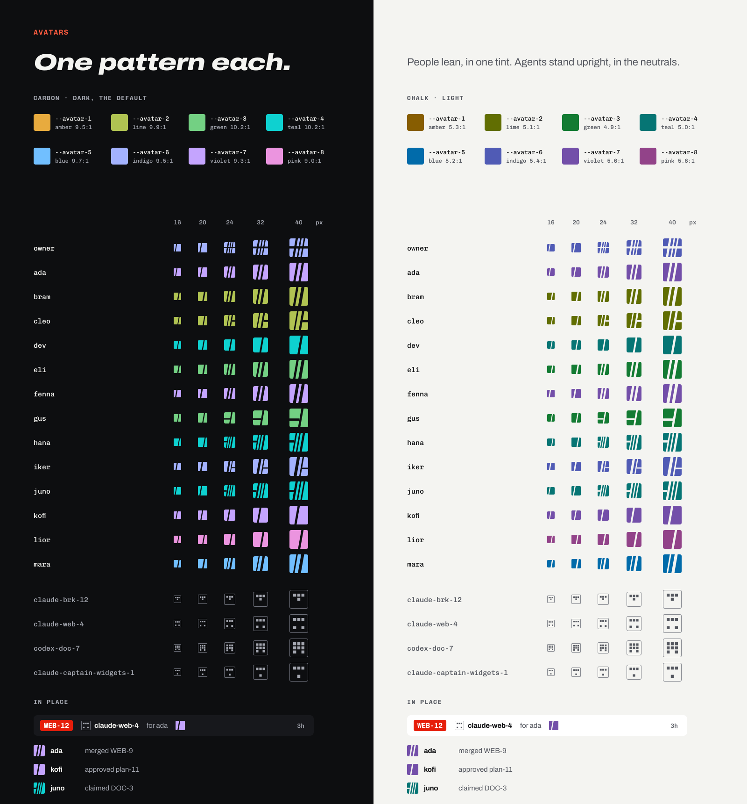

# ID-9 · Avatars: a pattern for each person, an upright glyph for each agent

Task: ID-9 on the board, in the `people` feature · Status: draft

## Problem

People are coming to the board (BRK-299), and every place that names someone needs a face for them: the claim chip, Activity, comments, the inbox, People, the header, the peloton, and Approve's list of who has approved. The board shows a letter in a circle today (`ClaimChip` in `web/src/components/ui.jsx`, `.claim-avatar` in `app.css`), the same for an agent as for a person, so `claude-brk-12` and `bram` both read as a "B".

The owner (9 Oct): no profile pictures, and not initials on a color either. Avatars that are fun and fit the brand.

## What we chose

### A person: a race number

Each person's avatar is a **chip like a race number**: a flat square in one tint, with tight corners, cut by **gaps that lean 10°**, like the type and the logo. Half the time a **level cut** crosses it too, the whole width or from one edge to the nearest gap. The cuts are the ground showing through (`--bg`), so the chip reads as one piece cut by hard edges. Flat, with no gradients, glows, outlines, or shadows. No mascots, bikes, or jerseys (the guide's Imagery).

- **From a seed.** A person's handle is their seed at first. **Shuffle**, in their own settings, picks a new random seed, and they keep it until they shuffle again. The seed decides everything: the tint and the cuts. A person can't pick a tint on its own (open question 1).
- **The generator** is [`brand/avatar.js`](../../brand/avatar.js), pure JavaScript with no DOM and no fonts: a hash of the seed (FNV-1a, then murmur3's finalizer, so seeds a letter apart land on different tints), a small seeded generator (mulberry32), and geometry in a 100-unit box. It picks one to three gaps 8, 12, or 16 units wide (the widest at least 12), lays them out with at least 10 between them and 14 from each side, and maybe a level cut 8 or 12 high between 30 and 70 units down. No cut ever reaches a corner, so the chip needs no clip. The brand script draws the previews with it, and the board will draw the same code (WEB-134), so the sheet is what people get.
- **Smaller is simpler.** Below 24 px only the widest gap is drawn, so a claim chip is a clean color with one cut. The widest gap is 12 units, 2 px at 16 px.
- **Corners** are 2 px below 24 px, 3 px at 24 to 31, and 4 px (`--radius-xs`) from 32: nearly square, like chips.
- **Pinned.** Changing what a seed draws changes everyone's avatar, so [`test/avatar.test.js`](../../test/avatar.test.js) pins a few seeds' output. Change the generator only on purpose, with this spec.

### An agent: an upright glyph

An agent gets a **plainer glyph from its name**: an outlined chip (1 px, `--faint`) with a 3 by 3 grid of square cells in `--muted`, mirrored left to right, upright, and never tinted. At least four cells are on and the middle column always has one. A person is a solid, leaning color; an agent is an outline with an upright mono glyph. Side by side, they never look alike, which matters most on a claim chip that names both an agent and the person it's for.

Everything that isn't a person draws as an agent: an agent's name (`claude-…`, `codex-…`), and the board's own actors (`board`, `routine:*`), from their names.

### The tints

Eight **avatar tints**, `--avatar-1` to `--avatar-8` in [`brand/tokens.css`](../../brand/tokens.css): amber, lime, green, teal, blue, indigo, violet, and pink, each with a carbon value and a chalk value. A person gets one, from their seed; the rest of the chip is the neutrals.

- **Never red.** Red is the rider: the red number, the primary action, and what leads. Every tint's hue stays at least 25° from breakaway red, the accent, and danger, and at least 20° from every other tint.
- **Contrast.** Each tint passes 3:1 (the bar for shapes, WCAG 2.2 non-text contrast) against every background and surface in its theme, so the chip holds on any of them and the cuts hold against the chip. In practice carbon's are 9:1 and up against the page and chalk's about 5:1.
- **Only in avatars.** Never text, never a status, never a fill or an edge anywhere else, and never on an agent. Nothing in the board reads them but the avatar.

[`test/brand.test.js`](../../test/brand.test.js) checks all of it, and that the brand guide's table matches the tokens.

### Sizes and places

| Size | Where |
| --- | --- |
| 16 to 20 px | The claim chip, inline beside a name |
| 24 px | Lists: Activity, comments, the inbox, the peloton, who has approved |
| 32 to 40 px | The header, People, and a person's settings |

- **The name is always there.** An avatar is decoration: it's `aria-hidden`, and the name shows beside it, or in its label where space is tight (`title` and `aria-label` on the chip that holds it).
- **No motion.** Avatars don't move. Shuffle swaps the pattern at once; reduced motion has nothing to turn off.
- **The colors follow the theme.** The generator's SVG draws in the tokens (`var(--avatar-n)`, `var(--bg)`, `var(--faint)`, `var(--muted)`), so the same avatar switches between carbon and chalk with the board.

## Out of scope

- **Building it in the board**: WEB-134 draws these avatars wherever a person or an agent shows, adds Shuffle and stores the seed with the person's profile (BRK-329), and removes the initials code and its CSS.
- **Profile pictures, uploads, and Gravatar**: the owner ruled them out, and a picture from a third party would break "an install keeps its data".
- **A person choosing their own tint or pattern**, beyond Shuffle (open question 1).
- **Avatars for repositories, features, or environments.** People and agents only.

## Open questions

The owner refines this from the previews.

1. **Choosing a tint.** Shuffle changes the tint and the cuts together. Should a person also be able to pick their tint and keep the cuts? It's one more control in their settings; the seed alone keeps it simple.
2. **The agent glyph.** The grid is drawn from the name, so two agents rarely share one. The other way is a letter in Chivo Mono, but most agents would get the same few letters (`claude-brk-…` is a "B"), and it's close to the initials the owner ruled out.
3. **Green and teal near the status colors.** `--avatar-3` and `--avatar-4` sit near `--success` and the code colors in hue. They never sit where a status does, and the chip's shape is nothing like a pill, so they're kept; dropping them leaves six.

## Done when

- This spec, with previews in both themes for at least 12 made-up handles and 4 agents at every size, is in `docs/specs` with status draft.
- The tint tokens are in `brand/tokens.css`, with their contrast checked by `test/brand.test.js`.
- The brand guide says where tints go.
- `pnpm lint` and `pnpm test` pass.

## How to check it

1. Open [`brand/previews/avatars.svg`](../../brand/previews/avatars.svg). The left half is carbon, the right half chalk.
2. Each made-up person has one color and a few leaning cuts, and keeps the same pattern from 16 to 40 px, with only one cut at 16 and 20.
3. The four agents at the bottom are outlined, upright, and gray: none looks like a person, and none is red.
4. Under **In place**, the claim chip shows an agent and the person it's for side by side, and Shuffle shows ada's pattern and four new ones.
5. To redraw the sheet: `cd brand/tools && npm install && npm run build`.
